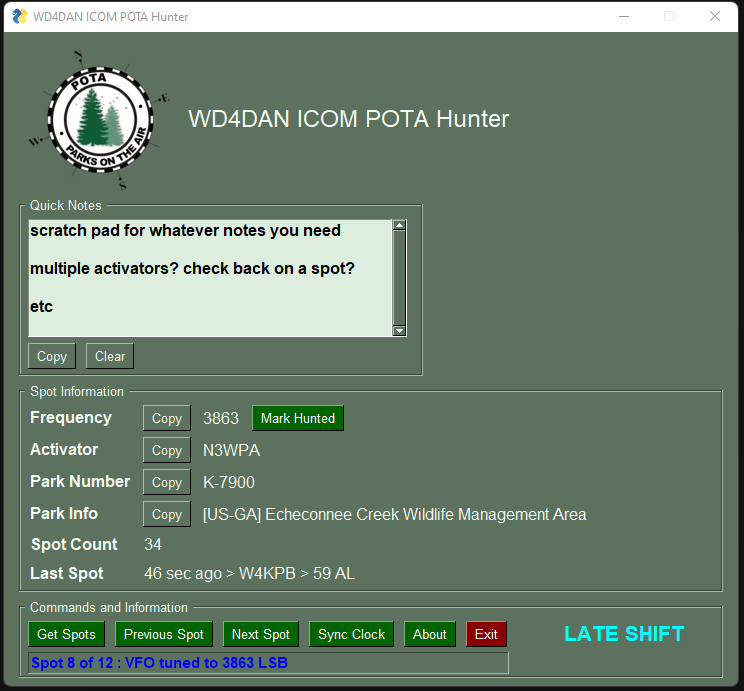

# icom_pota_hunter

NOTE: I'm really not developing this any longer since I found and use the POTAPlus Chrome/Edge Extension

Icom POTA (Parks on the Air) Hunter

Python script to fetch spots from Parks on the Air and tune your ICOM radio to the spot frequency

Requirements:
  pytz
  pyperclip
  PySimpleGUI

The Icom radio's CIV COM Port, Baud rate, and Address are hard coded into the script - you'll need to edit these

Does NOT require flrig or any third party software to be installed for Icom control.
Requires Icom to be connected via USB or CIV cable to a COM port

Please fork this and make it better! I am a horrendous python coder so excuse my messy crap.

